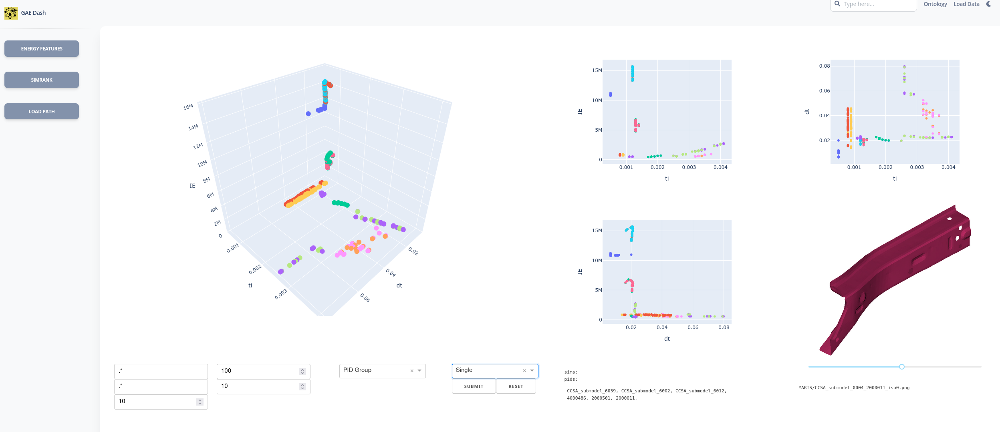

# Graph Assisted Engineering in Vehicle SafetyGAE-vehicle-safet

GAE is a Django project (Python) for the creation and study of the graph database for the CAE models as a Graph to build a knowledge graph for CAE. Converting Computer Aided Engineering (CAE) to Graph Aided Engineering (GAE).

- [Website (including documentation)](https://fraunhofer-scai.github.io/GAE-vehicle-safety/)
- [Source](https://github.com/Fraunhofer-SCAI/GAE-vehicle-safety)
- [Bug reports](https://github.com/Fraunhofer-SCAI/GAE-vehicle-safety/issues)
- [GitHub Discussions](https://github.com/Fraunhofer-SCAI/GAE-vehicle-safety/discussions)




<!-- Mailing list: https://groups.google.com/forum/#!forum/networkx-discuss -->
<!-- Report a security vulnerability: https://tidelift.com/security -->
<!-- Tutorial: https://networkx.org/documentation/latest/tutorial.html -->


GAE is a graph modeling for CAE analysis in automotive R&D development processes, in connection with its design requirement.
The first release of GAE considers vehicle safety with [EuroNCAP](https://www.euroncap.com/en) safety requirements.
We connect CAE data to the protocols that are used to assess vehicle safety performances.
The R&D process includes CAD engineering and safety attributes, with a focus on multidisciplinary problem-solving.
For morinformation of graph modeling, [link](https://arxiv.org/abs/2209.14910). 

<br />

<!-- TABLE OF CONTENTS -->
<details>
  <summary>Table of Contents</summary>
  <ol>
    <li><a href="##Run-Database-Server">Run Database Servery</a></li>
    <li><a href="##Databases">Databases</a></li>
        
  </ol>
</details>

<br />


## Dependencies 
Install the requirements via conda or python venv for python 3.10.8, for anacona  envs:

```
conda create -n envs python=3.8.6
conda activate envs
```

for virtual env, install python 3.8.6 and venv and then you can use:
```
python venv ./envs
source envs/bin/activate

```


## Run Database Server

Currently the database is availabledump`file that is that is developed with`neo4j-community-4.2.4`dump file can be loaded into `neo4j-community-4.2.4`. We provide this version as it is no longer availble on neo4j webpage. you can extract it and then run the server with

```
tar -xzvf neo4j-community-4.2.4.tar.gz
neo4j-community-4.2.4/bin/neo4j start
```

Then you can load one od available `.dump` file databases to your database.

```
./neo4j-community-4.2.4/bin/neo4j-admin load --from=../database/FILE.dump --database=neo4j --force
```

the `--force` will take care of the upgrade if you use a more recent version of neo4j, just remember to edit the config file in `conf\neo4j.conf` and set ``dbms.allow_upgrade=true`, [more info](https://neo4j.com/docs/operations-manual/current/configuration/neo4j-conf/)
<br />
<br />

### Databases

Here we have 5 dump files in `.\database` that are:

| Databases                 | Info                                                                                                                                                                                                                                                                                                               |
| ------------------------- | ------------------------------------------------------------------------------------------------------------------------------------------------------------------------------------------------------------------------------------------------------------------------------------------------------------------ |
| 00_GAE_v1.0.dump          | Merged version of all 4 databases                                                                                                                                                                                                                                                                                  |
| 01_modelCompare_v1.0.dump | FE-model changes, graph for [ModelCompare](https://www.scai.fraunhofer.de/de/geschaeftsfelder/numerische-datenbasierte-vorhersage/produkte/modelcompare.html) tool                                                                                                                                                 |
| 02_simKnowledge_v1.0.dump | F-simulation as a graph with energy features, "Knowledge discovery assistants for crash simulations with graph algorithms and energy absorption features", "Simrank++ Update for Crash Simulation Similarity Precidtion with Energy Absorption Features, [link](https://ins.uni-bonn.de/staff/garcke#publications) |
| 03_euroNcap_v1.0.dump     | Graph modeling [EuroNCAP](https://www.euroncap.com/en) safety requirements with web scrawling.                                                                                                                                                                                                                     |
| 04_safetyLoad_v1.0.dump   | load-case specification that is used in [CAEWebVis](https://caewebvis.scai.fraunhofer.de/) visualization                                                                                                                                                                                                           |

## Run Django
After solving the dependencies and setting up the database. You need to set the login info in a `.env` under `src/.env`. You can edit at the `src/.env-sample` and save it as `src/.env`.

To set the dependencies of your data to be loaded to the database, you need to define the constants in `src/gae/constatns.py`

```
## OEM or VEHICLE
OEM_NAME = 'YARIS'

## UNITs
IE_UNIT = 1e-3
TIME_UNIT = 1000

## DATA PATH
DATA_PATH = '/home/ndv/stud/data/YARIS/full_front/CCSA_submodel/crash_modes/'
SIM_PATTERN = 'CCSA_submodel_60*'
```

The units are defined base on the configuration of your model required to convert the values to kNmm, ms. THis example is for model with units of Nmm, s.

Finally you can strat the Django server locally with:
```
python src/manage.py runserver
```

This project has in total Five modules. This repo already includes:

- `ld_data`: based on [paper](https://ieeexplore.ieee.org/document/10030078), App links:
    - Load/ re-load data to the database based on `constants.py` configuratoion: `ld_data/load`
    - The data ontology report: `ld_data/ontology-report`
- `nrg_fts`: based on [paper](https://trebuchet.public.springernature.app/get_content/82909321-f1d5-4144-9c40-da25c33462f4), App links:
    - `nrg_fts_dash`: energy feature dash


The re-maining repos are under transfer from folllowing repo, unhold due to publications. for more information [contact](https://github.com/antahiap):

- `sim_rnk`: based on [paper](https://ins.uni-bonn.de/media/public/publication-media/01_KG_nrg_simlrty_simrnk_8qa35n3.pdf?name=01_KG_nrg_simlrty_simrnk.pdf), [current code](https://github.com/antahiap/nrg_simRank)
- `physc_grph`: based on [paper](https://link.springer.com/chapter/10.1007/978-3-031-40960-8_14), [current code](https://github.com/antahiap/nrg_mdl)
- `ld_pth_detn`: based on [paper](https://link.springer.com/chapter/10.1007/978-3-031-40960-8_14), [current code](https://github.com/antahiap/nrg_mdl)
